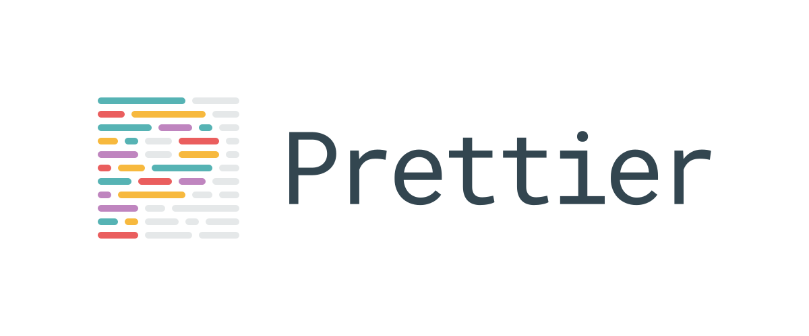

# First impressions matter

> First impressions matter, period.

It is essential for you as a developer
to know that making your project successful
is no different than selling a product.
They both obey what is called the
[Conversion Funnel](https://en.wikipedia.org/wiki/Conversion_funnel):

1. Initially,
   100% of the users visit our project on GitHub.
1. Some of them walk away,
   and only 80% of the users read what our project is about.
1. Some of them walk away,
   and only 50% of the users decide to try our project.
1. More of them walk away,
   and only 5% of the users keep using our project on a regular basis.

No matter what your project is about,
if we want it to be successful
we need to be able to "Convert" users
from visitors to active users.
We want them to engage regularly with the project,
post issues, ask for features,
recommend us to friends,
give stars,
fork,
and even contribute back code
or financially support the project.

There are a few techniques that we can use to maximize the [Conversion Rate](https://en.wikipedia.org/wiki/Conversion_marketing).

## A good README.md

A `README.md` file in the root of the repository
is going to be the first things your users see.
GitHub renders this file in main of the repository:

It's important that it's professional, colorful,
and that it grabs the user attention.

I highly recommend the following elements
are present in the first page:

1. **Logo and name**:
   A good logo is going to make the project look respected
   and professional.

   A good name is able to encapsulate the project's purpose,
   or, at the very least, should give the project an identity.

   This is an example from the
   [Prettier](https://github.com/prettier/prettier)
   project:

   

   It looks good.

   On the other hand, it encapsulates the purpose of the project:
   "Making your code prettier".
