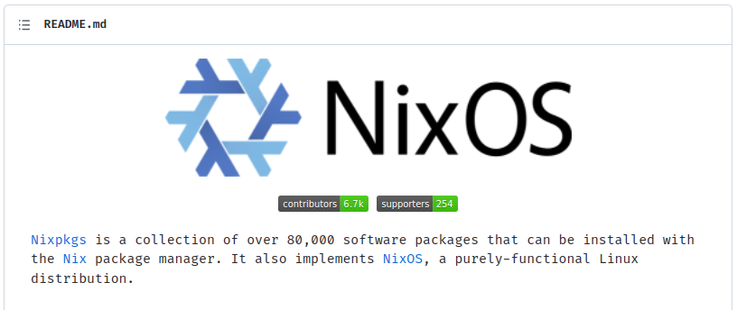
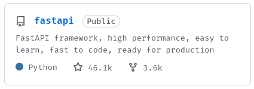
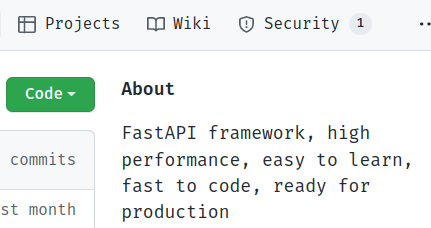
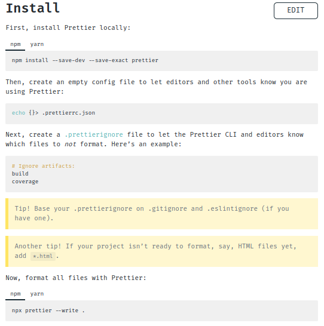
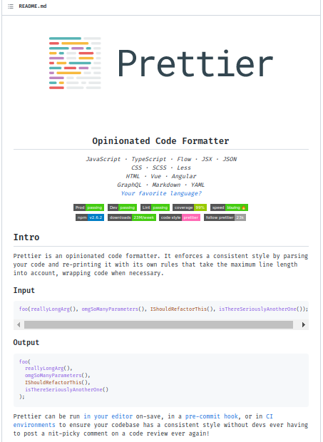
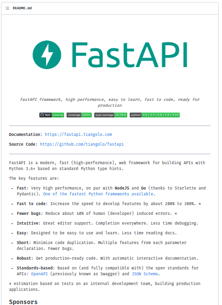
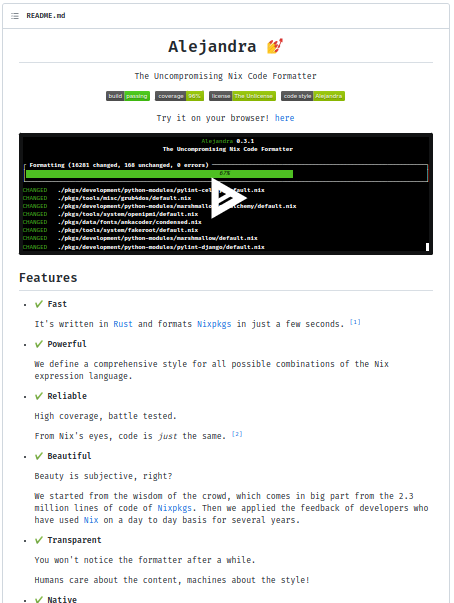

## A good `README.md`

A `README.md` file in the root of the repository
is going to be the first things your users see.
GitHub renders this file in the main page of the repository:

It's important that it's professional, colorful,
and that it grabs the user attention.

I highly recommend the following elements
are present in the first page:

1. **Logo and name**:
   A good logo is going to make the project look respected
   and professional.

   A good name is able to encapsulate the project's purpose,
   or, at the very least, should give the project an identity.

   This is an example from the
   [Prettier](https://github.com/prettier/prettier)
   project:

   

   It looks good.

   On the other hand, it encapsulates the purpose of the project:
   "Making your code prettier".

1. **Slogan**:
   A short, catchy phrase,
   summarizing what the project do and its most hot features.

   This is an example from the
   [FastAPI](https://github.com/tiangolo/fastapi)
   project:

   > FastAPI framework, high performance, easy to learn, fast to code, ready for production.

   Wow. Yes, I want high performance APIs.
   I want things easy to learn,
   no boilerplate,
   robust enough for production.

   While short,
   this slogan is very important
   because it's displayed in the project card:

   

   It can be the first thing a new visitor see
   and therefore can be the decisive factor
   for a user to click on it.

   It's also displayed in the top of the project home page:

   

   And sets the expectative for what comes next,
   it needs to be good.

1. **Description**:
   Here you will have a few paragraphs to
   explain what your project does,
   what problem it solves for your users,
   and why should a user be using it right now.

   This is an example from the
   [FastAPI](https://github.com/tiangolo/fastapi)
   project:

   > FastAPI is a modern, fast (high-performance),
   > web framework for building APIs with Python 3.6+
   > based on standard Python type hints.
   >
   > The key features are:
   >
   > - **Fast**: Very high performance, on par with **NodeJS** and **Go** (thanks to Starlette and Pydantic). [One of the fastest Python frameworks available](#performance).
   >
   > - **Fast to code**: Increase the speed to develop features by about 200% to 300%. \*
   > - **Fewer bugs**: Reduce about 40% of human (developer) induced errors. \*
   > - **Intuitive**: Great editor support. <abbr title="also known as auto-complete, autocompletion, IntelliSense">Completion</abbr> everywhere. Less time debugging.
   > - **Easy**: Designed to be easy to use and learn. Less time reading docs.
   > - **Short**: Minimize code duplication. Multiple features from each parameter declaration. Fewer bugs.
   > - **Robust**: Get production-ready code. With automatic interactive documentation.
   > - **Standards-based**: Based on (and fully compatible with) the open standards for APIs: <a href="https://github.com/OAI/OpenAPI-Specification" class="external-link" target="_blank">OpenAPI</a> (previously known as Swagger) and <a href="https://json-schema.org/" class="external-link" target="_blank">JSON Schema</a>.
   >
   > <small>\* estimation based on tests on an internal development team, building production applications.</small>

   Here the user knows that FastAPI helps building APIs with Python.
   They should be using FastAPI right now
   because it's fast, intuitive, easy, and so on.

   It's always a good idea to throw a few power words like: "Fast", "Powerful", "Secure", "Reliable".
   But of course make sure that this is true.

   You can further improve this section by adding emojis.

   This is an example from the
   [Alejandra](https://github.com/kamadorueda/alejandra)
   project:

   

   To this point your users should have a clear understanding of:

   - What problem does your project solve?
   - How does it make the user life easier?
   - What is special about it? What are the key features?

   But also make sure not to show unnecessary details.
   Try to find a balance.
   Too short and you'll leave questions unanswered.
   Too long and you'll bore or confuse them.

1. **Getting Started**:
   Users are interested at this point,
   they want action now.

   Here we place the shortest path a user can take
   in order to interact with the project.
   If there are many, show the fastest/easiest one first,
   and then slowly introduce them to the more complex ones.

   This is an example from the
   [Alejandra](https://github.com/kamadorueda/alejandra)
   project:

   

   It simply tells the user to use a web version of the project.
   Everybody knows how to click a link, that's easy, nice.

   This is an example from the
   [Prettier](https://github.com/prettier/prettier)
   project:

   

   Users familiar with Node JS
   will find the instructions easy to follow.
   However,
   some steps could have been removed
   and it would have worked the same.
   There is no need to overwhelm the user with details at this point.
   We can introduce the details later.

   For example, a better version would be:

   > Install prettier with:
   >
   > `$ npm install --save-dev prettier`
   >
   > Make your code beautiful with:
   >
   > `$ npx prettier --write .`

   Remember to keep the first impression simple and intuitive.

   Simplicity is key here.

All together, the following are examples of a good README:

- Prettier:

  

- FastAPI:

  

- Alejandra:

  

Lastly,
[makeareadme.com](https://www.makeareadme.com/) also offers some templates and tips.

You may want to have a look over there.
