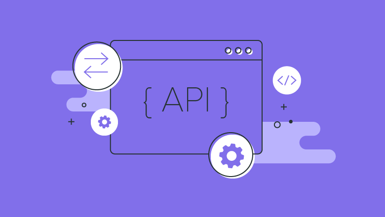
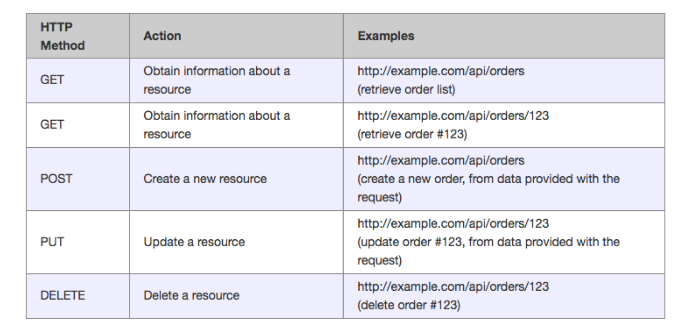

|  |
| --- |
# Tech Start's API Guide 

​​

APIs are a ubiquitous component of software engineering. APIs allow different components of a software system to interact with each other in a logical way.

Learning about APIs is critical to your growth as a software developer. This guide contains links and advice to get you started!

## Introduction

What is an API?

API stands for Application Programming Interface, and in simple words, allows two applications to talk to each other and send information between the two.

Further reading on the basics of APIs: [https://www.plektonlabs.com/api-101-what-are-they-and-how-do-they-work/?gclid=Cj0KCQiAhf2MBhDNARIsAKXU5GRbLqWDWBPN0Zh4ZX6KwjevURl9KmQo0EVBzLn5mcePxaI\_l1oWQSQaAkGDEALw\_wcB](https://www.google.com/url?q=https://www.plektonlabs.com/api-101-what-are-they-and-how-do-they-work/?gclid%3DCj0KCQiAhf2MBhDNARIsAKXU5GRbLqWDWBPN0Zh4ZX6KwjevURl9KmQo0EVBzLn5mcePxaI_l1oWQSQaAkGDEALw_wcB&sa=D&source=editors&ust=1696888756489716&usg=AOvVaw2sFkkuRQGwyN4yLkR7LQNb) 

Analogy of an API

Imagine you are sitting in a restaurant with a menu and you are trying to decide what to order. You are one of the applications and in order to get food, the kitchen will act like the other application. It is the system that will “make” you food. The waiter in this scenario will be the API, and he/she delivers the food from one application(the kitchen) to another(you). The waiter is the messenger that takes your request or order and tells the kitchen – the system – what to do. Then the waiter delivers the response back to you; in this case, it is the food.

How API’s Work

1. A client application initiates an API call to retrieve information—also known as a request. This request is processed from an application to the web server via the API’s Uniform Resource Identifier (URI) and includes a request verb(see Types of API calls), headers, and sometimes, a request body.
2. After receiving a valid request, the API makes a call to the external program or web server.
3. The server sends a response to the API with the requested information.
4. The API transfers the data to the initial application that requested the information.

Why would you need an API?

Many companies have APIs built to allow others to build interesting applications using their company data. APIs also allows a project to be dynamic - it will update the frontend information automatically when the back end is updated. This saves the hassle of going through tons of HTML code updating data one by one.

## Types of APIs

GraphQL vs Rest

Reading In favor of GraphQl: 

[https://www.howtographql.com/basics/1-graphql-is-the-better-rest/](https://www.google.com/url?q=https://www.howtographql.com/basics/1-graphql-is-the-better-rest/&sa=D&source=editors&ust=1696888756491467&usg=AOvVaw3ao5nh7YsI7EG405NvmPiA)

Reading In favor of Rest:

[https://www.rubrik.com/blog/technology/19/11/graphql-vs-rest-apis](https://www.google.com/url?q=https://www.rubrik.com/blog/technology/19/11/graphql-vs-rest-apis&sa=D&source=editors&ust=1696888756491731&usg=AOvVaw1uk4sQOCuRbIPo8NY_cbjo)

## 

## Rest APIs

About

[https://www.ibm.com/cloud/learn/rest-apis](https://www.google.com/url?q=https://www.ibm.com/cloud/learn/rest-apis&sa=D&source=editors&ust=1696888756492320&usg=AOvVaw0JwHkbfUUSOiPx96arRcR9)

A REST API is an API that conforms to the design principles of the REST, or representational state transfer architectural style. For this reason, REST APIs are sometimes referred to RESTful APIs.

What is a RESTful API? [https://www.youtube.com/watch?v=y0U-ZxgLu98](https://www.google.com/url?q=https://www.youtube.com/watch?v%3Dy0U-ZxgLu98&sa=D&source=editors&ust=1696888756492786&usg=AOvVaw0H_XwVo8q4zA-DbgAV1HKp)

Types of API calls

## Creating your own API

Interactive Resource on APIs

[https://apiary.io/how-to-build-api#phase-design](https://www.google.com/url?q=https://apiary.io/how-to-build-api%23phase-design&sa=D&source=editors&ust=1696888756493380&usg=AOvVaw2UMSZT2HeEVLcqvlI3FAb5)

Tons of help on creating API with different languages [https://rapidapi.com/blog/20-tutorials-on-how-to-create-your-own-api-sorted-by-programming-la](https://www.google.com/url?q=https://rapidapi.com/blog/20-tutorials-on-how-to-create-your-own-api-sorted-by-programming-lan&sa=D&source=editors&ust=1696888756493640&usg=AOvVaw2C0b_CWodq3Q_q8qwfUMhG)nguage/

Explanations of API’s and more in depth language-specific resources

[https://www.moesif.com/blog/api-guide/getting-started-with-apis/](https://www.google.com/url?q=https://www.moesif.com/blog/api-guide/getting-started-with-apis/&sa=D&source=editors&ust=1696888756493927&usg=AOvVaw3wG3-ArxT8ydYaMSke_PK_)

## 

## Using Postman

What is Postman?

Postman is a platform for building and using APIs. Postman simplifies each step of the API lifecycle and streamlines collaboration so you can create better APIs faster.

Getting Started with Postman: [https://www.guru99.com/postman-tutorial.html#1](https://www.google.com/url?q=https://www.guru99.com/postman-tutorial.html%231&sa=D&source=editors&ust=1696888756494592&usg=AOvVaw3LYlA3W3UFXXhO4fnY8JlQ)

Good Postman Series starting with setting up: [https://www.youtube.com/watch?v=juldrxDrSH0&ab\_channel=AutomationStepbyStep](https://www.google.com/url?q=https://www.youtube.com/watch?v%3DjuldrxDrSH0%26ab_channel%3DAutomationStepbyStep&sa=D&source=editors&ust=1696888756494809&usg=AOvVaw2hWzxaU8PKPPeyNynBiqmy)

## Further Resources on APIs

Collection of Free, premade API’s

\*Most premade API’s will have documentation of how to use/maintain them\*

[https://github.com/public-apis/public-apis](https://www.google.com/url?q=https://github.com/public-apis/public-apis&sa=D&source=editors&ust=1696888756495298&usg=AOvVaw3W3ykCzoZoFIO8zdzOQyhI) 

[https://any-api.com/](https://www.google.com/url?q=https://any-api.com/&sa=D&source=editors&ust=1696888756495444&usg=AOvVaw37iEQXdznjZMQEguH5sZoT) 

Example of using a premade API

[https://rapidapi.com/blog/how-to-use-an-api/](https://www.google.com/url?q=https://rapidapi.com/blog/how-to-use-an-api/&sa=D&source=editors&ust=1696888756495679&usg=AOvVaw1_iFMQszHtsU5XCOkla_yC) 

## GraphQL

Further Help 

GraphQL Tutorial: [https://www.youtube.com/watch?v=ed8SzALpx1Q&ab\_channel=freeCodeCamp.org](https://www.google.com/url?q=https://www.youtube.com/watch?v%3Ded8SzALpx1Q%26ab_channel%3DfreeCodeCamp.org&sa=D&source=editors&ust=1696888756496218&usg=AOvVaw1Ix_fLO2-F6dDVSo93hZnS) 

What is GraphQL (A really good article): [https://www.redhat.com/en/topics/api/what-is-graphql](https://www.google.com/url?q=https://www.redhat.com/en/topics/api/what-is-graphql&sa=D&source=editors&ust=1696888756496503&usg=AOvVaw0CYuaBNDRCgICjRw3LnR7L)

Why use GraphQL: [https://www.apollographql.com/docs/intro/benefits/](https://www.google.com/url?q=https://www.apollographql.com/docs/intro/benefits/&sa=D&source=editors&ust=1696888756496721&usg=AOvVaw02CkfRE2E4PoZDywuyxa-a) 

Getting started with GraphQL: [https://www.apollographql.com/docs/intro/benefits/](https://www.google.com/url?q=https://www.apollographql.com/docs/intro/benefits/&sa=D&source=editors&ust=1696888756496919&usg=AOvVaw3mEOG6zPQvR2hASAIl90eU) 

GraphQL is split into two main parts, A Schema (Basically a model for the response), and a resolver (a collection of functions that generate response for a GraphQL query. In simple terms, a resolver acts as a GraphQL query handler)

An article that explains what a Query, Mutation & Subscription are: [https://medium.com/software-insight/graphql-queries-mutations-and-subscriptions-286522b263d9](https://www.google.com/url?q=https://medium.com/software-insight/graphql-queries-mutations-and-subscriptions-286522b263d9&sa=D&source=editors&ust=1696888756497377&usg=AOvVaw0l79zjfcCdzUwbWOsK0RGK) 

