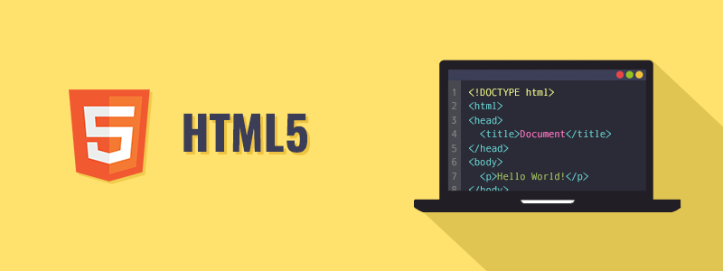
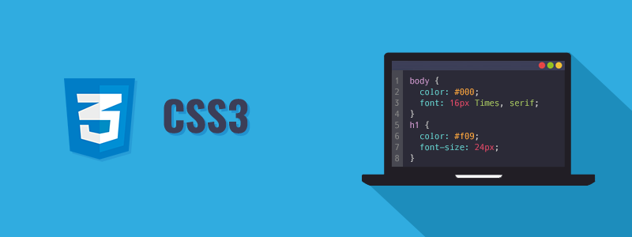
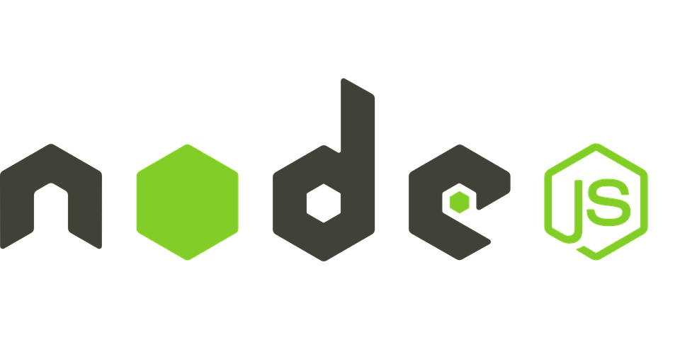
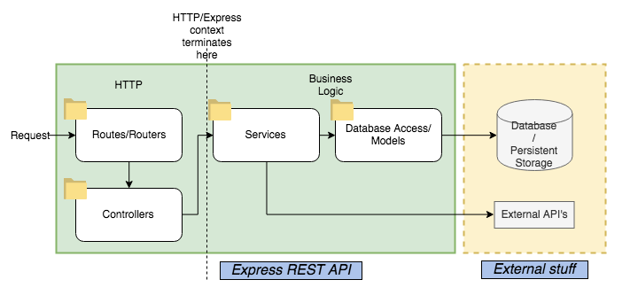
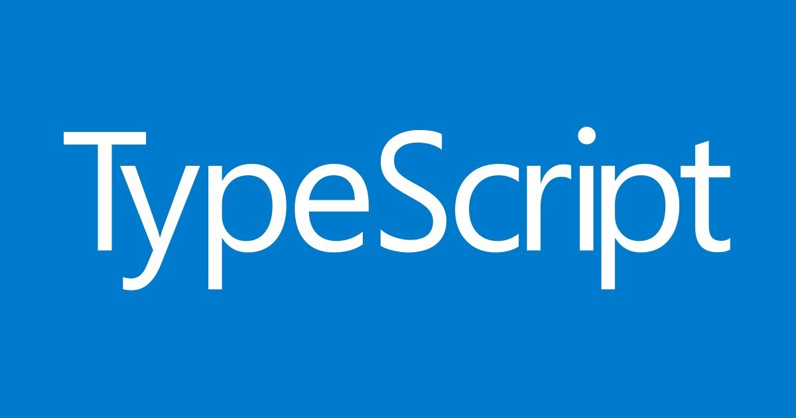
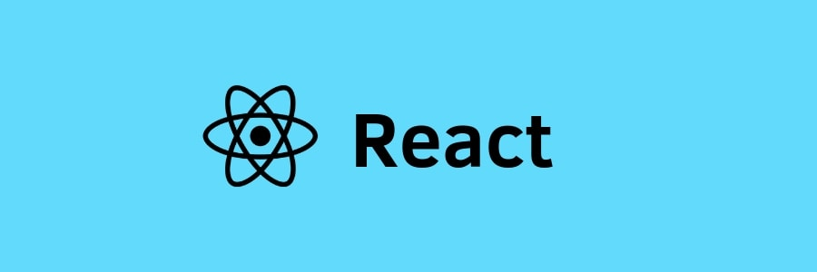
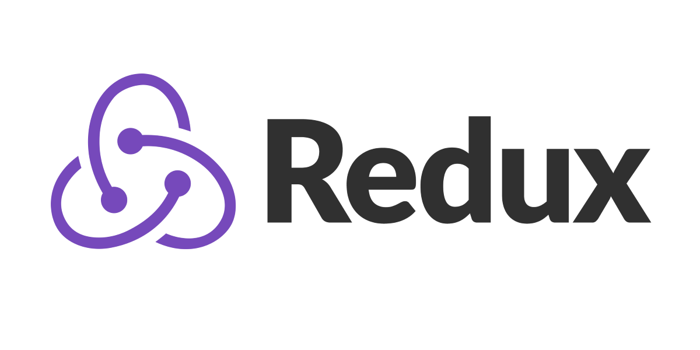

|  |
| --- |
# Tech Start's Super Awesome Mega Web Dev Guide:)  

**Want to get into web dev?** This guide should be your best friend. It covers some of the basic tools and languages you'll need to dive into the world of web development. Rather than providing tutorials, this guide focuses on directing you towards the best free online content to teach you the fundamentals.

Our advice:

* Go through at your own pace! You may need to spend more or less time on a particular topic depending on your experience level.
* Build practice websites and apps as you learn - you learn by doing.
* Take your own notes, especially for problems you encounter frequently
* Go beyond this guide! Tons of resources, courses, and tutorials are out there if you want to learn. Remember: google is a programmer's best friend.

This guide was originally developed for Tech Start UCalgary, an undergraduate club for software development and entrepreneurship at the University of Calgary. Check us out here -----> [https://linktr.ee/techstartuofc](https://linktr.ee/techstartuofc) &lt;-----

Or at our website here ---> [https://techstartucalgary.com](https://techstartucalgary.com) &lt;-----

If you're interested in contributing to this guide or in building similar guides for other areas (like Git, project management, or mobile development), please send me an email at [joel.happ1@ucalgary.ca](mailto:joel.happ1@ucalgary.ca)

Good luck on your web dev journey and enjoy the guide!

# Part 1 - HTML

HTML is the building block of all webpages. It's ubiquitous throughout application design - everything from websites to mobile apps to desktop apps use HTML as the base for their frontend. 

Luckily for you, HTML is also very simple. Don't spend too much time learning it as a beginner - while more advanced HTML concepts do exist, all you need to get started is a basic understanding of how it works.

To get started, I recommend watching this video and experimenting by building your own HTML document alongside it: [https://www.youtube.com/watch?v=UB1O30fR-EE](https://www.youtube.com/watch?v=UB1O30fR-EE)

To generate a favicon for your site, use this site: [https://realfavicongenerator.net/](https://realfavicongenerator.net/)

No matter which text editor you use (Atom, VSCode, Sublime Text, or something else), I recommend searching for editor plugins to improve your experience writing HTML. Google is your friend here.

# Part 2 - CSS

If HTML is the backbone of frontends, CSS is the paint. It's an extremely versatile and powerful way of styling and beautifying your content. CSS is easy to get into, but very difficult to master- if front-end development interests you, I recommend dedicating a significant amount of time towards learning CSS.

To get started, check out this 1 hour introductory video to CSS:

[https://www.youtube.com/watch?v=yfoY53QXEnI](https://www.youtube.com/watch?v=yfoY53QXEnI)

Another alternative is this free course on Scrimba, which also covers HTML: [https://scrimba.com/learn/htmlcss](https://scrimba.com/learn/htmlcss)

One topic that isn't covered in much detail in the previous video is CSS selectors. For most purposes, you'll probably want to keep your selectors simple (using only class names the vast majority of the time). If you want to learn more about advanced selectors, check out this video: [https://www.youtube.com/watch?v=Bcr70LIJcOk](https://www.youtube.com/watch?v=Bcr70LIJcOk)

When working on projects with other people, I recommend avoiding element-level selectors, as they can easily screw with work that others are doing. 

Once you have a good grasp of the basics of CSS, one area that I highly recommend learning is **CSS Grid.** CSS Grid is a fantastic way of organizing and positioning html content, and it comes with loads of features that make it easy to build adaptive web pages. By combining CSS Grid with CSS breakpoints, you can design interfaces that look great on any size of screen, whether it's a big desktop computer or a small mobile phone. 

Highly recommended course for CSS Grid:  [https://scrimba.com/learn/cssgrid](https://scrimba.com/learn/cssgrid)

(Warning: CSS grid is not supported by some outdated browsers and browsers like Opera Mini which are used mostly in third world countries to save data. If your intended audience includes these people, do not use CSS Grid.)

How should you organize and refactor your CSS? I recommend using the BEM strategy for your CSS selectors. [https://css-tricks.com/bem-101/](https://css-tricks.com/bem-101/)

BEM is a particularly helpful methodology to adopt when you're building websites from components like in React, since you can keep the CSS for each component in a separate file. However, it's far from the only strategy for CSS organization, so you can research and adopt others if they suit your needs better.

Knowing CSS Flexbox is also helpful for arranging the layouts of websites. It's like 

Finally, here is a great video to watch for some simple, powerful tips for writing modern CSS:

[https://www.youtube.com/watch?v=Qhaz36TZG5Y](https://www.youtube.com/watch?v=Qhaz36TZG5Y)

# 

# Part 3 - Javascript

JavaScript drives the interactivity and functionality of websites. Using it, you can respond to the user's interactions on your website and you can modify the properties of your HTML dynamically. 

To get started with JavaScript, you can watch this playlist: [https://www.youtube.com/playlist?list=PLDyQo7g0_nsX8_gZAB8KD1lL4j4halQBJ](https://www.youtube.com/playlist?list=PLDyQo7g0_nsX8_gZAB8KD1lL4j4halQBJ)

If you're brand new to programming, you should spend more time learning the fundamentals of JavaScript. 

There are a few areas of JavaScript which may be confusing to any newcomers to the language, even if you have previously learned other languages. I recommend practicing and studying to get used to these features.

**_Array functions:_** [https://www.youtube.com/watch?v=rRgD1yVwIvE](https://www.youtube.com/watch?v=rRgD1yVwIvE)

**_Asynchronous JavaScript (Await, Promises, Callbacks): _**[https://www.youtube.com/watch?v=_8gHHBlbziw](https://www.youtube.com/watch?v=_8gHHBlbziw)

**_JSON (JavaScript object notation): _**[https://www.youtube.com/watch?v=wI1CWzNtE-M](https://www.youtube.com/watch?v=wI1CWzNtE-M)

If you encounter another area of JavaScript that gives you troubles let me know and I'll add a section to this guide.

## 3.1 Node.js

Here's an introduction to Node.js: JavaScript, but for your operating system instead of your browser. [https://www.youtube.com/watch?v=ENrzD9HAZK4](https://www.youtube.com/watch?v=ENrzD9HAZK4) Node.js is frequently used as the backend for the server side of an application or web app. 

**Installing Node.js**

We recommend using NVM (node version manager) to install node.js. It allows you to install, uninstall, and switch between different versions of node.js very quickly. Often, you'll need to switch between different versions of node for different projects, so you'll save time by using nvm from the start.

NVM (Mac/Linux): [https://github.com/nvm-sh/nvm](https://github.com/nvm-sh/nvm)

NVM for windows: [https://github.com/coreybutler/nvm-windows](https://github.com/coreybutler/nvm-windows) 

Once installed, you can type "nvm" in your CLI to see a red list of commands you can use. Follow instructions on GitHub for proper usage!

**Express**

One of the most common Node.js frameworks is Express. Express is an unopinionated_ (meaning, it doesn't force you to do things any particular way) _framework that excels at allowing you to write APIs. We may include more content on Express here in the future.

## 

## 3.2** TypeScript**

TypeScript is a superset of Javascript that introduces new features mostly related to strong typing: this lets you safeguard your variables and functions and helps you catch the most frequent mistakes and bugs from JavaScript code. 

TypeScript is contained in .ts files, and using a compiler you can compile it into vanilla JavaScript .js files which run as expected on a computer. If you anticipate doing a lot of work with JavaScript, I highly recommend learning TypeScript - although it isn't necessary for every project, it immensely improves the quality of the coding experience and it can guide you towards mastering tricky concepts from JavaScript like promises and callbacks.

TypeScript tutorial by NetNinja:

[https://www.youtube.com/playlist?list=PL4cUxeGkcC9gUgr39Q_yD6v-bSyMwKPUI](https://www.youtube.com/playlist?list=PL4cUxeGkcC9gUgr39Q_yD6v-bSyMwKPUI)

TypeScript Basics by JavaBrains: (also includes small project incl. API usage)

[https://www.youtube.com/playlist?list=PLqq-6Pq4lTTanfgsbnFzfWUhhAz3tIezU](https://www.youtube.com/playlist?list=PLqq-6Pq4lTTanfgsbnFzfWUhhAz3tIezU)

# 

# Part 4 - React

NOTE: here is a more indepth [React Guide](../React_Guide/README.md), the better version!!

HTML, CSS, and JS are great and all, but what if you want to make a modern, reactive website? Several frontend frameworks exist to empower dynamic, reactive sites, and as of 2021 React is by far the most popular among them. It's a great way to get an introduction into the world of web frameworks and it's a fun tool to use. 

Here's a good free overview of the basics of React: [https://scrimba.com/learn/learnreact](https://scrimba.com/learn/learnreact)

Plenty of similar courses are available on YouTube and other course platforms. 

When in doubt, consult the React documentation: [https://reactjs.org/docs/](https://reactjs.org/docs/)

Note that much of the documentation still uses class-based components, as opposed to function-based components. Nowadays, it is 99% preferable to use function-based components whenever possible. It cuts down on the amount of boilerplate you need to write and enables helpful features from hooks.

Learn more about React Hooks: [https://www.youtube.com/watch?v=TNhaISOUy6Q](https://www.youtube.com/watch?v=TNhaISOUy6Q&t=396s)

The 2 hooks in particular you should be very familiar with:

* **useState - **for basic state/data management
* **useEffect** - ubiquitous in React. It is used for creating consequences ("effects") for changes in data. It's a critical part of designing React applications to have a functional (not object-oriented) architecture, and you should be using it to create custom hooks.

Other hooks that are handy to know about are useRef, useCallback, and useLayoutEffect.

To learn React, you should know HTML, CSS, and JS before. You can also build React apps with TypeScript instead of JavaScript. [https://www.typescriptlang.org/docs/handbook/react.html](https://www.typescriptlang.org/docs/handbook/react.html)

**React Context API**

The context API is a tool you can use in React to share state from an upper level component (a provider) to its children. If you have state that needs to be shared across many children, you can use the context API rather than pass everything down manually as props.

To learn about the context API, I recommend watching this video:

[https://www.youtube.com/watch?v=35lXWvCuM8o](https://www.youtube.com/watch?v=35lXWvCuM8o)

**React Router **

If you want to make React websites with multiple pages, you can use React Router.  It is a package that enables your app to have multiple routes. This series gives a quick overview of React Router:

[https://www.youtube.com/watch?v=aZGzwEjZrXc&list=PL4cUxeGkcC9gZD-Tvwfod2gaISzfRiP9d&index=21](https://www.youtube.com/watch?v=aZGzwEjZrXc&list=PL4cUxeGkcC9gZD-Tvwfod2gaISzfRiP9d&index=21)

React Router is lightweight and best suited for very small projects. If you plan on building a larger website with React, we recommend using Next.js instead - it has a lot more features including pre-rendering pages on the server for SEO optimization. Next.js is also widely used and has industry-level support.

React Redux is a commonly used package for managing global state. It allows you to take care of state in a global store that can be accessed or modified from anywhere in your application. 

[https://www.youtube.com/watch?v=CVpUuw9XSjY](https://www.youtube.com/watch?v=CVpUuw9XSjY)

**Using React with Typescript**

Here is a great cheatsheet that you should read to get started with using React in combination with Typescript:

[https://github.com/typescript-cheatsheets/react](https://github.com/typescript-cheatsheets/react)

That's it! .. for now :)

Happy hacking!
