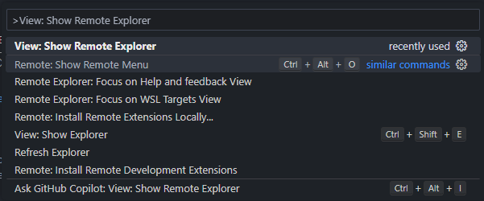

# Installfest: From zero to hero

#### Introduction
We understand that setting up your computer for development can be a daunting task. There are so many tools and libraries that you need to install, and it's hard to know where to start. That's why we created this guide to help you get started with your development environment.


This guide will help you install all the tools you need to start coding. It will also help you configure your computer so that you can easily switch between different versions of Node.js and Python. Your don't need to install everything in this guide, only the tools you need for your project. If you are not sure what tools you need, ask your project lead or one of the exec members.

#### Table of Contents
  - [Windows Users](#windows-users)
  - [Installing Homebrew](#installing-homebrew)
  - [Installing Git](#installing-git)
  - [Installing Node](#installing-node)
  - [Installing Nvm](#installing-nvm)
  - [Installing Python](#installing-python)
  - [Installing Pip](#installing-pip)
  - [Installing Pyenv](#installing-pyenv)
  - [That's it!](#thats-it)

#### Windows Users
If you are using Windows, we recommend that you install WSL2 and Ubuntu as your development environment. You can find instructions on how to do so here: [WSL2 Installation](../wsl2/README.md) Once you have installed WSL2 and Ubuntu, you can continue with this guide.

#### Installing Homebrew
Homebrew is a package manager for macOS (or Linux) that allows you to easily install and manage software packages and libraries. It simplifies the installation process by automating the installation of dependencies and providing a consistent interface for installing software. To install Homebrew, run the following command:

```bash
/bin/bash -c "$(curl -fsSL https://raw.githubusercontent.com/Homebrew/install/HEAD/install.sh)"
```

To check if Homebrew is installed, run the following command:

```bash
brew --version
```

It should return something like this:

```bash
Homebrew 3.2.0
Homebrew/homebrew-core (git revision 3b6; last commit 2021-07-26)
```

#### Installing VSCode: MacOS
Visual Studio Code is a free source-code editor made by Microsoft for Windows, Linux and macOS. Features include support for debugging, syntax highlighting, intelligent code completion, snippets, code refactoring, and embedded Git. To install VSCode, run the following command:

```bash
brew install --cask visual-studio-code
```

To check if VSCode is installed, run the following command:

```bash
code --version
```

#### Installing VSCode: Windows WSFL2

To install VSCode, download it from the following link: [VSCode Installer](https://code.visualstudio.com/) Once downloaded, open VScode in Windows.

Open the remote explorer by pressing `Ctrl+Shift+P` and typing `View: Show Remote Explorer` and selecting `WSL Targets`.



Then select `Ubuntu 20.04` or the version of Ubuntu you installed. This will cause some reinstalling to happen, but once it's done, you will be able to use VSCode with Ubuntu.

Now you can go back to the WSL2 terminal and open VSCode by running the following command:

```bash
code .
```

#### Installing Git
Git is a free and open-source distributed version control system designed to handle everything from small to very large projects with speed and efficiency. It is the most widely used modern version control system in the world today. To start using Git, you need to run the following command:

```bash
brew install git
```

To check if Git is installed, run the following command:

```bash
git --version
```

To configure Git, run the following commands:

```bash
git config --global user.name "YOUR_NAME"
```

```bash
git config --global user.email "YOUR_EMAIL"
```

Then donwload the github cli:

```bash
brew install gh
```

and authenticate with your github account:

```bash
gh auth login
```

to check if it worked:

```bash
gh auth status
```

#### Installing Node
Node.js is an open-source, cross-platform, back-end JavaScript runtime environment that runs on the V8 engine and executes JavaScript code outside a web browser. It allows developers to use JavaScript to write command-line tools and for server-side scripting—running scripts server-side to produce dynamic web page content before the page is sent to the user's web browser. To install Node, run the following command:

```bash
brew install node
```

To check if Node is installed, run the following command:

```bash
node --version
```

#### Installing Nvm
nvm stands for Node Version Manager. It is a tool that allows you to easily install and manage multiple versions of Node.js on a single machine. This is useful for developers who need to work with different versions of Node.js for different projects. To install nvm, run the following command:

```bash
brew install nvm
```

To check if nvm is installed, run the following command:

```bash
nvm --version
```

To change versions of node, run the following command:

```bash
nvm install <version>
```

for example:

```bash
nvm install 14.17.6
```

To see which version are available, run the following command:

```bash
nvm ls-remote
```

make sure you team is using the same version of node for consistency and to avoid errors.

#### Installing Python
Python is an interpreted, high-level, general-purpose programming language. Created by Guido van Rossum and first released in 1991, Python's design philosophy emphasizes code readability with its notable use of significant whitespace. To install Python, run the following command:

```bash
brew install python
```

By default, Homebrew installs Python 3.x. To check if Python is installed, run the following command:

```bash
python3 --version
```

#### Installing Pip
pip is a package management system used to install and manage software packages written in Python. Many packages can be found in the Python Package Index (PyPI).

```bash
brew install pip
```

To check if pip is installed, run the following command:

```bash
pip --version
```

#### Installing Pyenv
pyenv is a simple yet powerful tool that allows you to easily install and manage multiple versions of Python on a single machine. This is useful for developers who need to work with different versions of Python for different projects. Using pyenv will also allow you to group your project dependencies into a single virtual environments, which will make dependency management much easier. To install pyenv, run the following command:

```bash
brew install pyenv
```

To check if pyenv is installed, run the following command:

```bash
pyenv --version
```

pyenv will be useful for those who are working with Django or Flask.


#### That's it!
Now that you have installed all the tools you need, you are ready to start coding like a PRO. If you have any questions, feel free to ask your project lead or one of the exec members.

